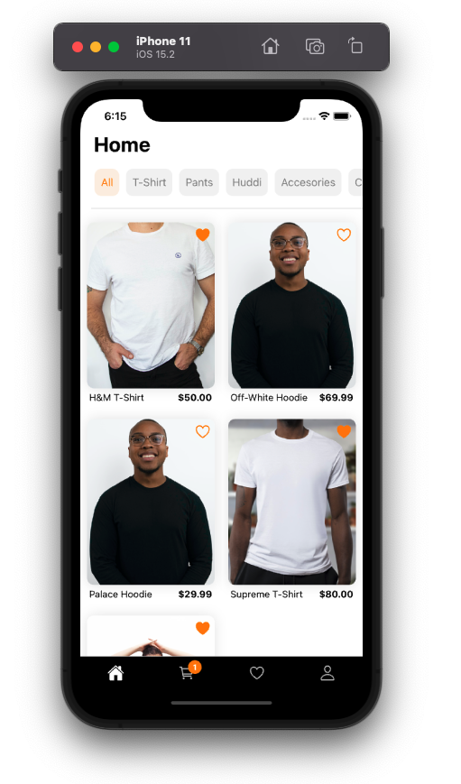

# fluffy-shop

Development of native cross-platform mobile shop application for Android/iOS devices using React-Native framework

## Table of Contents

- [Description](#description)
  - [Built with](#build-with)
- [Requirements](#requirements)
  - [Node](#node)
- [Install](#install)
- [Running the project ](#running-the-project)
- [Authors ](#authors)

## Description

The application was written in the MERN technology stack. It consists of technologies such as MongoDB, Express, React-Native and Node.js. The functionality of the entire store is based on simplicity and clarity for customer choice. It allows you to filter the product database, order them and track the status of shipments.

### Build with

- React-Native
- NodeJS
    * bcrypt
    * express
- MongoDB

---
## Requirements

For development, you will need Node.js and a node global package, xcode/android-studio, installed in your environement.

### Node
- #### Node installation on Windows

Just go on [official Node.js website](https://nodejs.org/) and download the installer.
Also, be sure to have `git` available in your PATH, `npm` might need it (You can find git [here](https://git-scm.com/)).

- #### Node installation on Ubuntu

  You can install nodejs and npm easily with apt install, just run the following commands.

      $ sudo apt install nodejs
      $ sudo apt install npm

- #### Other Operating Systems
  You can find more information about the installation on the [official Node.js website](https://nodejs.org/) and the [official NPM website](https://npmjs.org/).

If the installation was successful, you should be able to run the following command.

    $ node --version
    v14.16.1

    $ npm --version
    6.14.12

If you need to update `npm`, you can make it using `npm`! Cool right? After running the following command, just open again the command line and be happy.

    $ npm install npm -g

## Install

    $ git clone https://github.com/SzymonZur/fluffy-shop
    $ cd fluffy-shop
    $ npm i
    
    After that you need to create file env file with your config.

## Running the project

    -backend $ npm run start
    -frontend $ npm run start

## Authors

- Szymon Żur - Linkedin - [@szymonżur](https://www.linkedin.com/in/szymon%C5%BCur/)